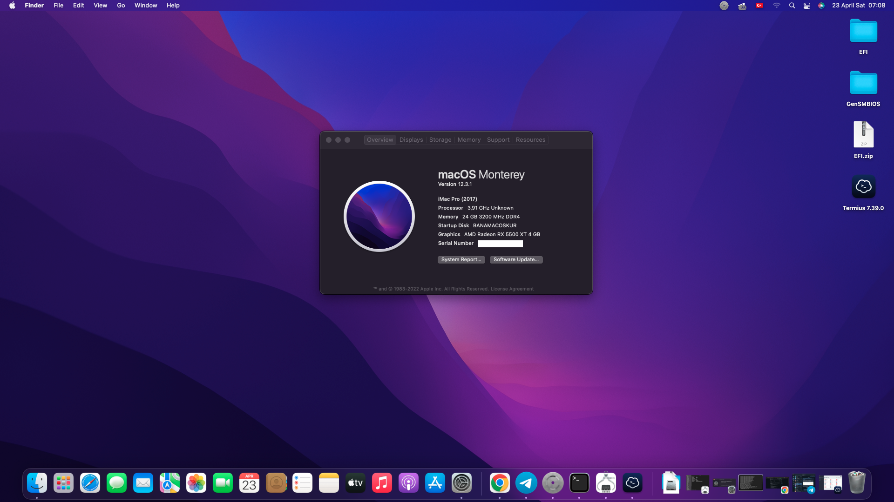

# z590-tomahawk-wifi-hackintosh-efi

# Thanks to Yusuf for his template!

- This is the repository of my main system based on Msi z590 and 11th gen Intel CPU.
- From this repository you can download the EFI folder

## Specs?
- CPU : Intel i5 11600k
- CPU Cooler : Arctic Freezer 34 eSports Duo
- Motherboard : MSI MAG Z590 TOMAHAWK WIFI Bios 7D08v24
- Memory : Kingston FURY Beast RGB 64GB (2x32GB) 3200MHz DDR4 CL16
- Storage : A lot of storage :) 6/6 sata ports are filled up.
- Video Card : XFX Speedster MERC 319 RX 6900 XT Black Gaming V2 (no type-c output edition) , and my second gpu MSI MECH 5500 xt 4GB
- Wifi Card : Intel® Wi-Fi 6E AX210
- Bluetooth : Onboard bluetooth Intel® Wi-Fi 6E AX210
  
## OpenCore Version?
0.8.0

## What's Working?
- [x] WIFI AirportBrcmFixup Fixed :)
- [x] Bluetooth and ethernet
- [x] Working with latest Monterey 12.4 (21F79)
- [x] QE/CI Graphics Of XFX Speedster MERC 319 RX 6900 XT Black Gaming V2 or MSI Mech 5500 xt 4G
- [x] Restart and Shutdown. 
- [x] Rear Jack (Green) + Front Speaker Jack (Headphone)
- [x] HDMI Audio
- [x] HDMI Output
- [x] Display Port Audio
- [x] Display Port output
- [x] HEVC and H264 Encode for RX 5500 XT
- [x] All USB ports at full speed (including USB-C)
- [x] Sleep 
- [x] Jack Mic
- [x] etc

## What's not Working?
- [ ] SideCar due to the lack of an iGPU (Not Tested)
- [ ] etc

## Credits
- [Dortania](https://github.com/dortania) for the Opencore Desktop Guide
- [Acidanthera](https://github.com/acidanthera) for too many things to mention each, starting from Opencore bootloader to a lot of crucial kexts...
- [CorpNewt](https://github.com/corpnewt) for ProperTree and GenSMBIOS scripts
- [chris1111](https://github.com/chris1111) for the Opencore Modern theme which I used in this EFI folder 
- [yusufklncc](https://github.com/yusufklncc) for his entire opencore layout of 0.8.0
- [OSX-INFO FORUM](https://osxinfo.net/) for helping
And to a few others to get everything working :)

